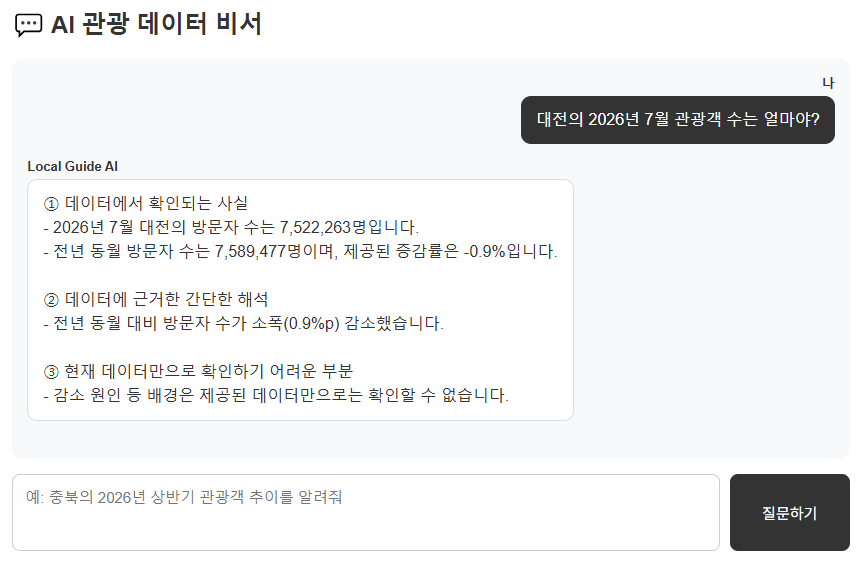
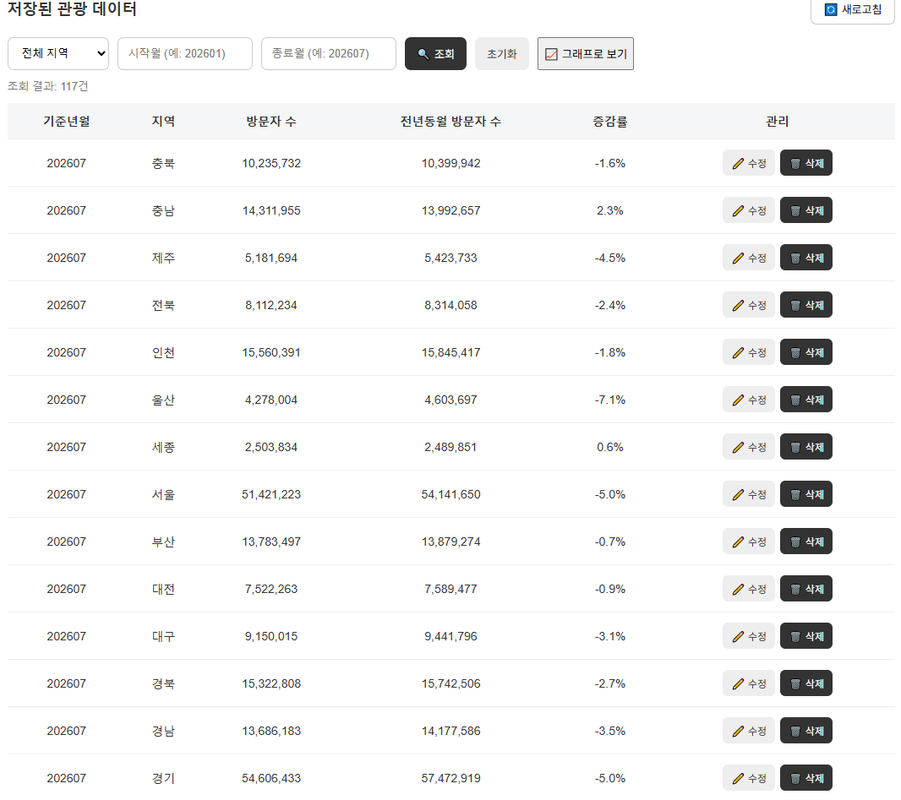
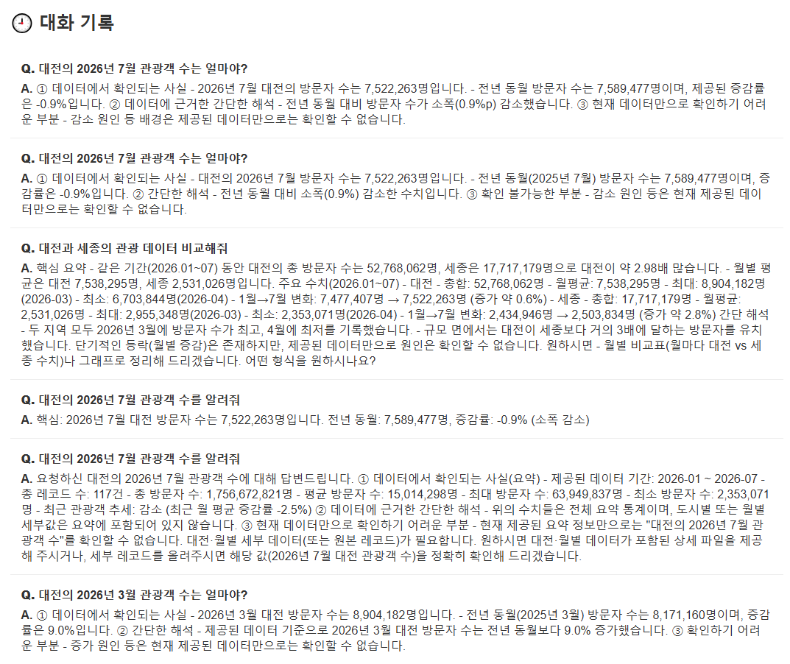

# Local Guide AI

지역 관광 데이터를 기반으로 정보를 제공하는 **AI 관광 데이터 비서 서비스** 프로젝트입니다.

관광 데이터를 분석하고 Firestore에 저장한 뒤, FastAPI 기반 API와 AI 채팅 기능을 통해 사용자가 자연어로 관광 데이터에 대해 질문하고 답변을 받을 수 있도록 구현했습니다.

## 🌐 배포 서비스

[Local Guide AI 바로가기](https://local-guide-ai.onrender.com)
---

## 1. 프로젝트 소개

### 프로젝트 목적

관광 데이터를 단순히 표와 그래프로 확인하는 것에서 나아가,

> **"데이터를 직접 조회하지 않아도 AI에게 질문하면 관광 데이터에 대한 답변을 받을 수 있는 서비스"**

를 만드는 것을 목표로 합니다.

사용자는 웹 화면에서 관광 데이터를 관리하고, 저장된 관광 데이터의 요약 정보를 바탕으로 AI에게 자연어 질문을 할 수 있습니다.

### 주요 기능

* 관광 데이터 추가 / 조회 / 수정 / 삭제
* 방문자 수와 전년동월 방문자 수를 이용한 증감률 자동 계산
* 지역 및 기간별 관광 데이터 조회
* 최신 기준년월부터 데이터 정렬
* 관광 데이터 요약 정보 제공
* AI 관광 데이터 질문 및 답변
* 관광 데이터에 근거한 AI 답변 생성
* AI 대화 자동 저장
* 이전 대화 기록 조회
* 특정 대화 불러오기
* 월별 관광객 추이 그래프
* FastAPI Swagger API 문서 제공

---

## 2. 프로젝트 구조

```text
Local-Guide-AI
│
├─ frontend/
│  ├─ index.html
│  ├─ style.css
│  └─ script.js
│
├─ routers/
│  ├─ data.py
│  ├─ chat.py
│  └─ conversations.py
│
├─ schemas/
│  └─ data.py
│
├─ images/
│  ├─ 01_AI_질문답변.png
│  ├─ 02_데이터_CRUD.png
│  └─ 03_대화목록.png
│
├─ firebase_config.py
├─ upload_to_api.py
├─ main.py
├─ requirements.txt
└─ README.md
```

---

## 3. 기술 스택

| 구분                  | 기술                                  |
| ------------------- | ----------------------------------- |
| 언어                  | Python                              |
| Backend             | FastAPI                             |
| Database            | Firebase Firestore                  |
| AI                  | Codyssey OpenAI 호환 API / GPT-5 mini |
| Data Analysis       | Pandas, NumPy                       |
| Visualization       | Matplotlib, Chart.js                |
| Time Series         | Holt-Winters Exponential Smoothing  |
| Validation          | Pydantic                            |
| Frontend            | HTML, CSS, JavaScript               |
| API Documentation   | Swagger UI                          |
| Backend Deployment  | Render                              |

---

## 4. 데이터

### 데이터 출처

한국관광 데이터랩의 지역별 관광 현황 데이터를 활용했습니다.

활용 데이터는 전국 17개 시·도의 관광 방문자 데이터입니다.

주요 변수는 다음과 같습니다.

| 변수       | 설명                 |
| -------- | ------------------ |
| 기준년월     | 관광 방문자 수가 집계된 연월   |
| 지역       | 전국 17개 시·도         |
| 방문자 수     | 해당 지역의 관광 방문자 수    |
| 전년동월 방문자 수 | 전년 같은 달의 관광 방문자 수  |
| 방문자 수 증감률  | 전년 동월 대비 방문자 수 증감률 |

### 데이터 기간

* 주요 분석 데이터: 2023년 1월 ~ 2025년 12월
* 최신 비교 데이터: 2026년 1월 ~ 2026년 7월

2023~2025년 데이터는 17개 지역 × 36개월 = 612개 관측값으로 구성되어 있습니다.

2026년 데이터는 17개 지역 × 7개월 = 119개 관측값입니다.

이 중 광주와 전남의 2026년 7월 데이터는 원본에서 0으로 제공되었으나 실제 방문자 수가 아닌 자료 미제공에 따른 값으로 확인되어 분석 및 AI 데이터 구축 과정에서 제외했습니다.

따라서 2026년 데이터 중 유효한 117건의 관광 데이터를 Firestore에 저장했습니다.


---

## 5. 데이터 분석

프로젝트 초기 단계에서는 AI 관광 데이터 비서 구현에 활용할 관광 데이터의 특징을 파악하기 위해 시계열 분석을 진행했습니다.

### 분석 내용

* 전체 관광 방문자 수 장기 추세
* 3개월 이동평균
* 월별 계절성
* 지역별 2023 → 2025 변화율
* 주요 지역별 관광 방문자 추세
* 월별 전년 대비 증감률
* 2026년 1~7월 최신 관광 흐름
* Holt-Winters 기반 관광 방문자 수 예측

### 주요 분석 결과

2023~2025년 전체 관광 방문자 수는 장기적으로 증가하는 흐름을 보였으며, 월별 평균 방문자 수를 비교한 결과 10월이 가장 높고 2월이 가장 낮은 등 계절성이 확인되었습니다.

지역별로는 17개 지역 중 15개 지역에서 2023년 대비 2025년 평균 방문자 수가 증가했지만, 증가 폭에는 지역별 차이가 나타났습니다.

이러한 분석 결과는 Firestore 데이터 구조 설계와 AI 답변 생성을 위한 관광 데이터 요약 기준으로 활용했습니다.

---

## 6. AI 관광 데이터 비서

분석 결과를 단순히 확인하는 것에서 나아가, 저장된 관광 데이터의 요약 정보를 바탕으로 자연어 질문에 답변하는 AI 비서를 구현했습니다.

사용자는 다음과 같은 질문을 입력할 수 있습니다.

```text
현재 관광 데이터의 전체적인 추세를 알려줘
```

또는

```text
현재 저장된 관광 데이터의 평균 방문자 수는 얼마야?
```

AI 채팅 API는 Firestore에 저장된 관광 데이터에서 기간, 레코드 수, 총 방문자 수, 평균 방문자 수, 최대·최소 방문자 수, 최근 증감 추세 등을 계산하여 AI에게 데이터 문맥으로 전달합니다.

### AI 처리 흐름

```text
사용자 질문
     ↓
FastAPI /api/chat
     ↓
Firestore 관광 데이터 조회
     ↓
데이터 요약 생성
     ↓
시스템 프롬프트에 데이터 요약 정보 주입
     ↓
GPT-5 mini 답변 생성
     ↓
대화 기록 Firestore 저장
     ↓
사용자에게 답변 표시
```

### AI 답변 원칙

AI가 관광 데이터에 없는 내용을 임의로 만들어내지 않도록 시스템 프롬프트에 다음 원칙을 적용했습니다.

* 제공된 관광 데이터를 근거로 답변
* 데이터에 없는 사실을 임의로 생성하지 않음
* 관광객 증가·감소의 원인을 데이터만으로 확인할 수 없는 경우 추측하지 않음
* 데이터로 확인되는 사실과 해석을 구분
* 데이터가 부족한 질문에는 확인할 수 없는 부분을 명확하게 안내

예를 들어 최근 관광객 감소 원인을 질문했을 때, 현재 데이터만으로 원인을 확인할 수 없다면 특정 정책이나 날씨, 교통 등의 요인을 실제 원인이라고 단정하지 않고 **"현재 데이터만으로는 원인을 확인할 수 없습니다."**라고 안내합니다.

### AI API 구성

현재 개발 환경에서는 비용 발생을 방지하기 위해 일반 OpenAI API 대신 Codyssey의 OpenAI 호환 API를 사용하고 있습니다.


```text
OpenAI 호환 API
      ↓
GPT-5 mini
      ↓
Local Guide AI 답변 생성
```

---

## 7. 데이터 관리 기능

웹 화면에서 관광 데이터를 직접 관리할 수 있습니다.

### 데이터 추가

입력 항목:

* 기준년월
* 지역
* 방문자 수
* 전년동월 방문자 수

증감률은 사용자가 직접 입력하지 않고 서버에서 자동 계산합니다.

다음 공식으로 계산합니다.

증감률(%)
= (방문자 수 - 전년동월 방문자 수)
  ÷ 전년동월 방문자 수 × 100

이를 통해 방문자 수 수정 시 증감률이 잘못된 값으로 남는 문제를 방지했습니다.

### 데이터 조회

다음 조건으로 관광 데이터를 조회할 수 있습니다.

* 전체 데이터
* 지역별 데이터
* 기간별 데이터

조회 결과는 최신 기준년월이 먼저 표시되도록 정렬했습니다.

### 데이터 수정

저장된 데이터의 다음 항목을 수정할 수 있습니다.

* 기준년월
* 지역
* 방문자 수
* 전년동월 방문자 수

수정 후 증감률은 다시 자동 계산됩니다.

### 데이터 삭제

개별 데이터를 선택하여 삭제할 수 있으며, 전체 데이터 삭제 기능도 제공합니다.

---

## 8. 관광 데이터 그래프

웹 화면에서는 조회된 관광 데이터를 그래프로 확인할 수 있습니다.

### 월별 관광객 추이

조회 조건에 따라 선택한 관광 데이터를 월별 방문자 수 추이 그래프로 확인할 수 있습니다.

그래프는 Chart.js를 사용하여 구현했으며, 시간 흐름에 따른 관광객 변화 패턴을 직관적으로 확인할 수 있습니다.

이를 통해 표 형태의 데이터뿐 아니라 관광 방문자의 증가·감소 흐름과 변화 추세를 쉽게 파악할 수 있습니다.

---

## 9. 대화 기록

AI와의 대화 내용은 Firestore에 저장됩니다.

저장되는 주요 정보:

```text
question
answer
messages
summary
created_at
```

AI 채팅을 통해 생성된 대화 내용은 Firestore에 자동 저장됩니다.

웹 화면에서는 저장된 이전 대화 목록을 확인할 수 있으며, 특정 대화를 선택하면 해당 질문과 AI 답변 내용을 다시 확인할 수 있습니다.

---

## 10. Firestore 구조

### `data`

관광 방문자 데이터를 저장하는 컬렉션입니다.

```text
data
 ├─ date              # 기준년월
 ├─ region            # 지역
 ├─ visitor_count     # 방문자 수
 ├─ previous_count    # 전년동월 방문자 수
 └─ change_rate       # 방문자 수 증감률
```

### `conversations`

AI 대화 기록을 저장합니다.

```text
conversations
 ├─ question      # 사용자 질문
 ├─ answer        # AI 답변
 ├─ messages      # 대화 메시지 정보
 ├─ summary       # 질문 당시 데이터 요약 정보
 └─ created_at    # 생성 시간
```

---

## 11. API

### 관광 데이터

| Method | Endpoint | 기능 |
| ------ | -------- | ---- |
| POST | `/api/data` | 데이터 추가 |
| GET | `/api/data` | 데이터 조회 |
| PUT | `/api/data/{id}` | 데이터 수정 |
| DELETE | `/api/data/{id}` | 개별 데이터 삭제 |
| DELETE | `/api/data` | 전체 데이터 삭제 |

### AI

| Method | Endpoint | 기능 |
| ------ | -------- | ---- |
| POST | `/api/chat` | 관광 데이터 기반 AI 질문 및 답변 |

### 대화 기록

| Method | Endpoint | 기능 |
| ------ | -------- | ---- |
| POST | `/api/conversations` | 대화 저장 |
| GET | `/api/conversations` | 대화 목록 조회 |
| GET | `/api/conversations/{id}` | 특정 대화 조회 |
| DELETE | `/api/conversations/{id}` | 대화 삭제 |

---

## 12. Swagger UI

FastAPI 서버 실행 후 Swagger UI를 통해 등록된 API 목록과 요청·응답 형식을 확인하고 테스트할 수 있습니다.

```text
127.0.0.1:8000/docs
```

Swagger UI를 통해 각 API의 요청 및 응답 형식을 직접 확인하고 테스트할 수 있습니다.

---

## 13. 로컬 실행 방법

### 1. 저장소 클론

```bash
git clone <GitHub Repository URL>
cd <project-directory>
```

### 2. 가상환경 생성

```bash
python -m venv .venv
```

### 3. 가상환경 활성화

Windows PowerShell:

```powershell
.venv\Scripts\Activate.ps1
```

### 4. 라이브러리 설치

```bash
pip install -r requirements.txt
```

### 5. 환경변수 설정

프로젝트 루트에 `.env` 파일을 생성합니다.

```text
OPENAI_API_KEY=your_codyssey_virtual_key
OPENAI_BASE_URL=https://copa.codyssey.kr/v1
OPENAI_MODEL=gpt-5-mini
```

Firebase Firestore 사용을 위한 서비스 계정 인증 설정도 필요합니다.

서비스 계정 키와 API Key 같은 민감 정보는 GitHub에 업로드하지 않습니다.

### 6. FastAPI 실행

```bash
uvicorn main:app --reload
```

실행 후:

```text
127.0.0.1:8000
```

Swagger:

```text
127.0.0.1:8000/docs
```

### 7. 실행 확인

FastAPI 서버 실행 후 브라우저에서 다음 주소로 접속합니다.

```text
http://127.0.0.1:8000/
```

---

## 14. 프로젝트 실행 확인

프로젝트 실행 후 다음 기능을 확인할 수 있습니다.

* 관광 데이터 조회 및 관리
* 관광 데이터 기반 AI 질문·답변
* 관광 데이터 시각화
* 대화 기록 저장 및 조회
* Firestore 데이터 연동
* Swagger UI를 통한 API 확인 및 테스트

현재 프로젝트의 주요 기능은 FastAPI와 Firestore를 기반으로 구현되어 있습니다.


---

## 15. 주요 화면

### 1. AI 관광 데이터 질의

사용자가 관광 데이터에 대해 자연어로 질문하면 AI가 저장된 관광 데이터와 데이터 요약 정보를 바탕으로 답변합니다.



### 2. 관광 데이터 관리

관광 데이터를 조회하고 추가·수정·삭제할 수 있으며, 데이터 변경 사항이 Firestore에 반영됩니다.



### 3. 대화 기록

이전에 진행한 AI 대화를 조회할 수 있으며, 특정 대화를 선택하면 질문과 AI 답변을 다시 확인할 수 있습니다.



---

## 16. 배포

### Backend

FastAPI 서버는 Render를 이용하여 배포할 예정이며,
배포 완료 후 URL을 추가합니다.

```text
Backend URL
https://local-guide-ai.onrender.com
```

배포 시 다음과 같은 환경변수를 Render에 설정합니다.

```text
OPENAI_API_KEY
OPENAI_BASE_URL
OPENAI_MODEL

Firebase 관련 인증 설정
```

### Frontend

HTML/CSS/JavaScript 기반 프론트엔드는 현재 FastAPI 서버를 통해 함께 실행하고 있으며, 향후 필요에 따라 Vercel 등 별도의 호스팅 환경에 배포할 수 있도록 구성합니다.

```text
Frontend URL
https://local-guide-ai.onrender.com
```

프론트엔드를 별도로 배포하는 경우 배포된 Backend API 주소에 맞게 API 서버 주소를 설정합니다.

---

## 17. 향후 발전 방향

현재 구현한 관광 데이터 AI 비서를 기반으로 다음과 같이 확장할 수 있습니다.

* 지역별 관광 데이터 비교 및 분석 기능 강화
* 기간별 관광 추이와 증감률을 활용한 분석 기능 확대
* 관광 데이터 기반 지역 추천 및 홍보 아이디어 제공
* 최신 관광 데이터 자동 수집 및 업데이트
* 지역 관광 담당자가 활용할 수 있는 의사결정 지원 기능 강화
* 실제 서비스 환경에 맞춘 UI 및 사용자 경험 개선

---

## 18. AI 활용

본 프로젝트에서는 관광 데이터를 단순히 조회하는 것이 아니라, 사용자가 자연어로 질문하고 AI가 관광 데이터를 바탕으로 답변할 수 있도록 구성했습니다.

AI 활용 과정은 다음과 같습니다.

* Firestore에 저장된 관광 데이터 조회
* 관광 데이터 요약 정보 생성
* 사용자 질문과 데이터 요약 정보를 AI에 전달
* GPT-5 mini를 활용한 답변 생성
* 생성된 질문과 답변을 대화 기록으로 저장

---

## 19. 프로젝트 정리

본 프로젝트는 지역 관광 데이터를 Firestore에 저장하고, FastAPI를 통해 데이터를 관리하며, 관광 데이터 요약 정보를 활용하여 GPT-5 mini 기반의 AI 질의응답 기능을 제공하도록 구현했습니다.

주요 구현 내용은 다음과 같습니다.

* 관광 데이터 Firestore 저장 및 CRUD 기능
* 관광 데이터 요약 및 통계 제공
* 자연어 기반 AI 관광 데이터 질의응답
* 관광 데이터 시각화
* AI 대화 기록 저장 및 조회
* FastAPI 기반 REST API 구성
* Swagger UI를 통한 API 문서 및 테스트 환경 제공

이를 통해 데이터 수집 및 저장부터 분석, API 구성, AI 답변 생성, 서비스 화면 구현까지의 전체 개발 과정을 경험했습니다.

---

## 20. 프로젝트 요약

```text
관광 데이터
     ↓
Python 데이터 분석
     ↓
Firestore 저장
     ↓
FastAPI API
     ↓
관광 데이터 요약
     ↓
GPT-5 mini 기반 AI 관광 데이터 비서
     ↓
자연어 질문 / 답변
     ↓
대화 기록 저장
```

**Local Guide AI는 관광 데이터를 단순히 분석하는 것에서 나아가, 사용자가 데이터를 직접 관리하고 저장된 관광 데이터에 대해 자연어로 질문할 수 있는 AI 기반 관광 데이터 비서입니다.**
